# Betrayal for UT4
A port of the _Unreal Tournament 3_ gametype **Betrayal** created with C++ for **_[Unreal Tournament](//www.unrealtournament.com)_**

__Key features__:  
- Instagib only gametype
- Semi team play
- Custom sounds and textures (ported from UT3)
- Player beacons including player score
- Bot AI betraying team mates
- Scoreboard showing daggers (and other stats)
- HUD showing game type info like team, current pot and roque players
- Additional stats for player cards
- _...and more_

__What's Betrayal__:  
Betrayal is a new instagib game type that pits players against each other while they cooperate in temporary alliances. Only one player is the final winner, and the difference between victory and defeat often lies in knowing when to betray your teammates.

A score above opponents’ heads reflect their value if you gib them using the primary fire of your instagib rifle. Current teammates are blue, and every kill by a teammate adds one point to the team pot, which is shown at the top of your HUD.  Teammates can betray each other using the alternate fire of the rifle, which shoots a blue beam. Assassinating a teammate gives the assassin both the score over that player’s head, plus all the points accrued in the team pot.  

However, the assassin becomes a Rogue for 30 seconds, during which he is not on any team, and his former teammates can garner a score bonus for achieving retribution by killing him.   The score above a Rogue’s head is red for his former teammates.  Once the rogue timer has counted down, the rogue will automatically join a new team when teammates are available.

Daggers beside each player’s name shows the number of times that player has betrayed his teammates.  Watch your back around teammates; you’ll often see players pause and check each other out as they enter a room together.

Sometimes, players may try to goad a teammate into killing them by shooting blue beams by their ear when the team pot is small, hoping to later cash in on the retribution bonus.  As the players near victory, they’ll often try to time a final betrayal to send them over the top.

# Installation

 - Download the [lastest version](/../../releases/latest)
 - Extract the zip file to your Unreal Tournament folder:  
   `UnrealTournamentDev\`

# Usage

__Method 1:__
 - Start the game
 - Choose a custom game
 - Select the game mode `Betrayal`
 - Choose any map you like and play the game
 - Enjoy.

__Method 2:__
 - Add the following line to the command line arguments (or your shortcut, server command line, ...):  
  `?game=UTBetrayal.UTBetrayalGameMode`
 - Start the game

# Preview
Betrayal fire modes:  
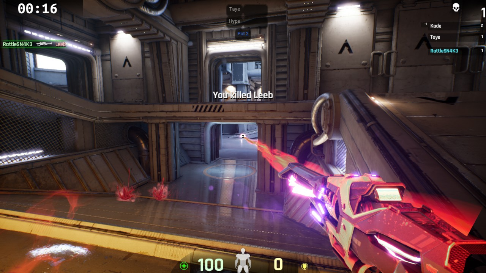
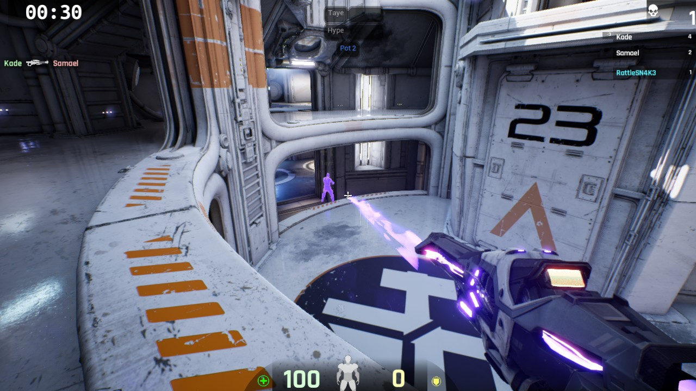

General HUD:  
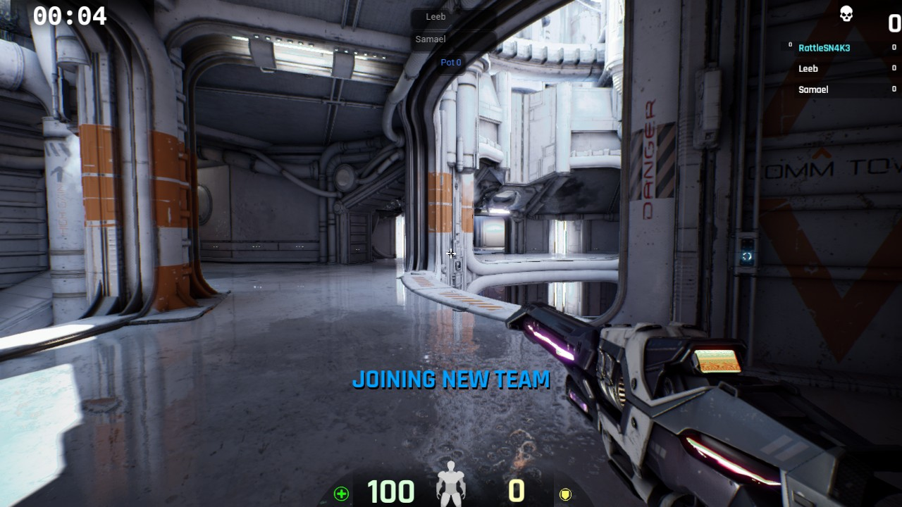
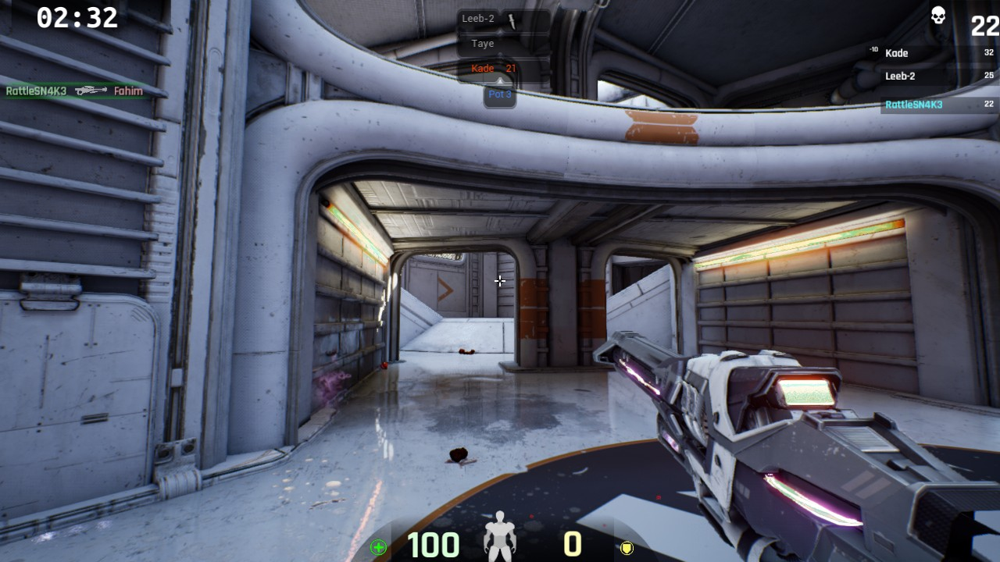

Various beacons above players (with transparency):  
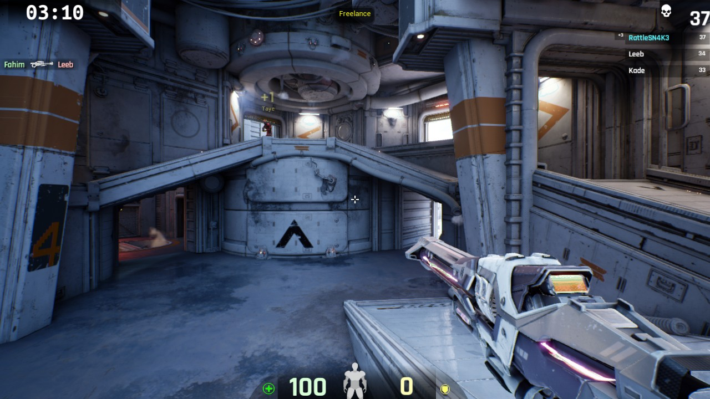
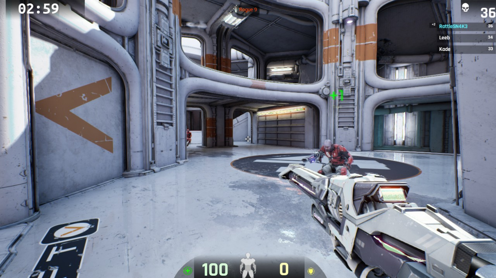
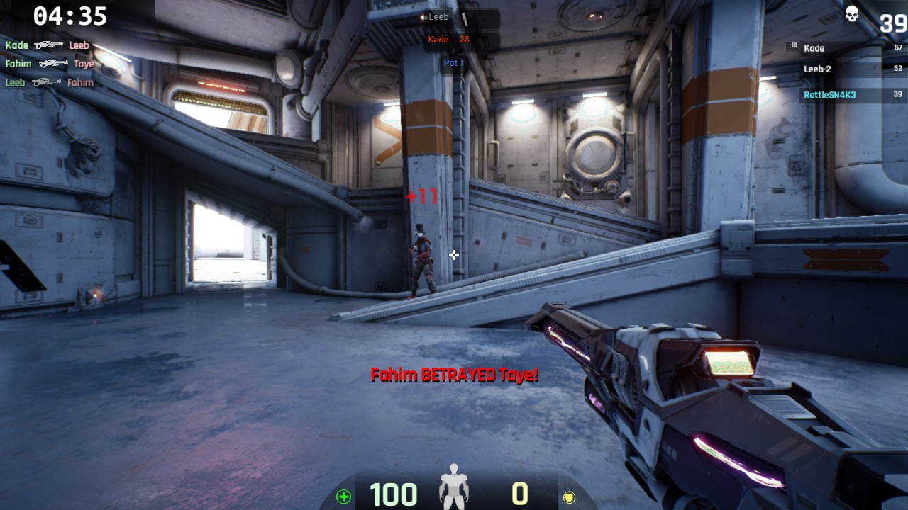

Scoreboard with highlighted team mates:  
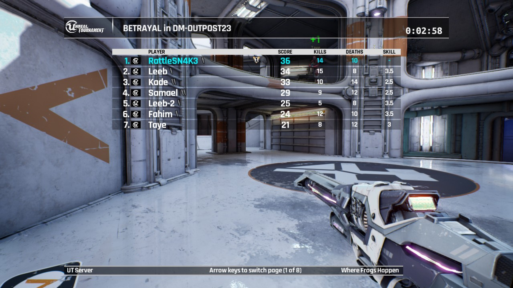
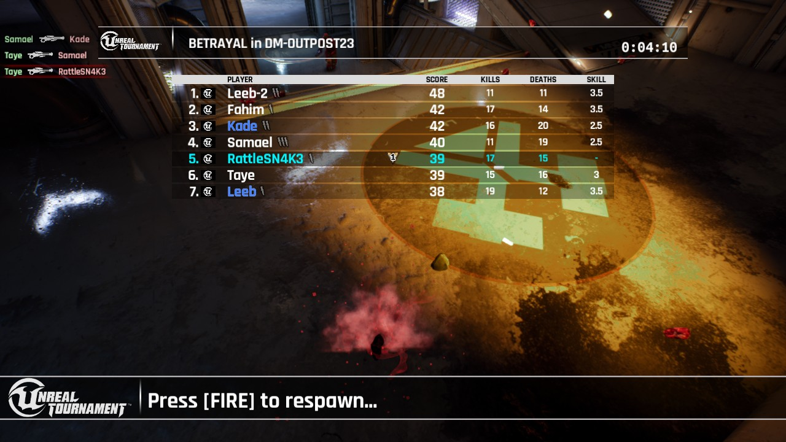

Game Messages:  

Team Players with bright skin:  
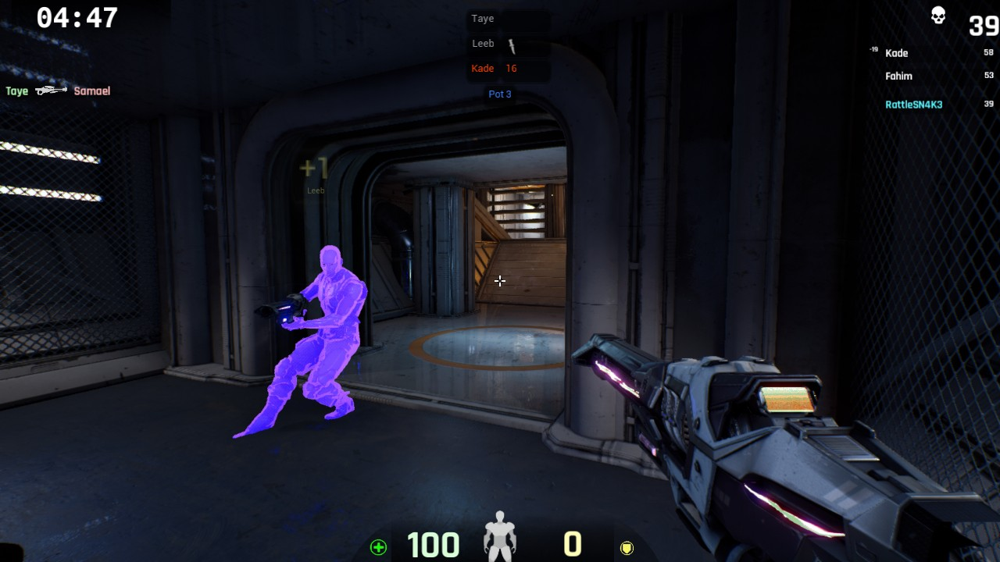

Player card with additional stats for Betrayal:  
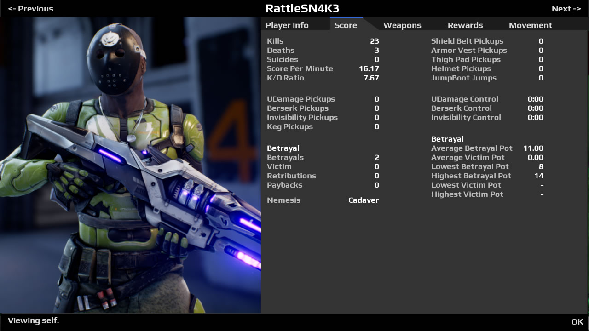

# Compiling

This plugin is created with the code-base of the latest release of the _Unreal Tournament_ source code. In order to fully support using this plugin with the [Launcher versions of Unreal Tournament](https://www.unrealtournament.com/download), a specific commit/version/tag needs to be checked out. You can always find the used commit in the [CHANGELIST file](CHANGELIST.editor) which directs to the specific commit in the release branch of the UT repository.

Before the code can be compiled, the engine must be aware of the installed source files and the source files must be placed into the correct folder.

## Setup

For easy referencing, `%basedir%` would be the root folder of your local [GitHub repository of Unreal Tournament](https://github.com/EpicGames/UnrealTournament).

- Download the [latest source files](/../../archive/master.zip)
- Unpack the file into the *Plugins* folder located at:  
  `%basedir%\UnrealTournament\Plugins\UTBetrayal`
- Generate the project files with the specific batch file:  
  - Windows: `%basedir%\GenerateProjectFiles.bat`
  - Linux: `%basedir%\GenerateProjectFiles.command`
  - Mac: `%basedir%\GenerateProjectFiles.sh`

## Make

The source files should be compiled by the Unreal Build System. Each specific platform and version has to be compiled with the specific command line arguments.

Solution configuration list for each game version:
- Editor: Development Editor
- Client: Test
- Server: Test Server

Compile the solution with either configuration for the desired version and target platform.

## Testing

With the current build, _Unreal Tournament Editor_ has the same network version as the client build. You don't need to use a workaround.

Otherwise, you need to compile the source code additionally with a different code-base. The compiled version for the editor cannot be used with the client build. You need to compile the source code for each specific version or use the workaround in order o run the compiled editor version with the client build.

### Editor

If you are using the specific changelist, as specified in the [CHANGELIST.editor](CHANGELIST.editor) file, you can use the compiled source with the editor by just copying the binary file and the content into `Plugins` of the Launcher editor (_Editor configuration_ required): `UnrealTournamentEditor\UnrealTournament\Plugins`

### Client/Server  

0. \[SKIP IF CHANGELISTS [[1](CHANGELIST.editor)][[2](CHANGELIST.client)] ARE THE SAME\]. Hex-modify the specific binary file with the changelist specified in [CHANGELIST.editor](CHANGELIST.editor) to the changelist specified in [CHANGELIST.client](CHANGELIST.client)
0. Browse to `Engine\Build\BatchFiles`
0. Run the build automation tool with:  
     - Windows (64-bit): `RunUAT.bat MakeUTDLC -DLCName=UTBetrayal -platform=Win64 -version=3008041`
     - Windows (32-bit): `RunUAT.bat MakeUTDLC -DLCName=UTBetrayal -platform=Win32 -version=3008041`
     - Linux: `RunUAT.bat MakeUTDLC -DLCName=UTBetrayal -platform=Linux -version=3008041`
     - Mac: `RunUAT.bat MakeUTDLC -DLCName=UTBetrayal -platform=Mac -version=3008041`
0. Wait until cooking process is done (could take a while)
0. After cooking is done, the cooked and staged content package of this plugin can be found under:
   - Windows: `UnrealTournament\Saved\StagedBuilds\UTBetrayal\WindowsNoEditor\UnrealTournament\Content\Paks`
   - Linux: `UnrealTournament\Saved\StagedBuilds\UTBetrayal\LinuxNoEditor\UnrealTournament\Content\Paks`
   - Mac: `UnrealTournament\Saved\StagedBuilds\UTBetrayal\MacNoEditor\UnrealTournament\Content\Paks`
0. Copy the files the the launcher plugin folder. %plugindir% would be `UnrealTournamentDev\UnrealTournament\Plugins\UTBetrayal`.
   - Copy the plugin descriptor file `UTBetrayal.uplugin` to `%plugindir%\`
   - Copy the binary files to `%plugindir%\Binaries\`
   - Copy the cooked PAK file to `%plugindir%\Content\Paks\`

# Author
RattleSN4K3
